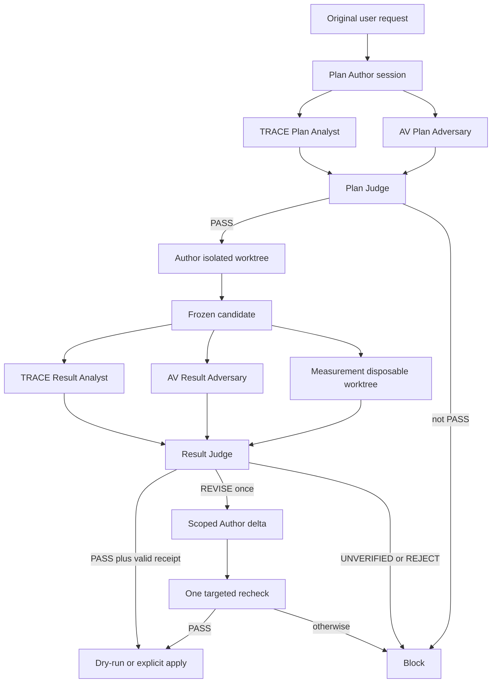

# Adversarial Validation + TRACE for Codex

This repository contains two complementary Codex Skills and a separate Python
orchestration runtime:

- **`adversarial-validation`** — challenges a consequential technical plan once
  before implementation and challenges the final candidate once after the work
  is complete.
- **`trace-adversarial-validation`** — an explicit-only extension that audits
  observable E0-E4 process evidence and assesses `P-proc` only.
- **Python orchestrator** — runs the strict, isolated TRACE Analyst +
  Adversarial Validation Adversary + Measurement + Judge workflow.

The Skills are behavioral instructions loaded by Codex. The Python orchestrator
is executable runtime infrastructure; installing one does not install or start
the other.

## Workflow

```text
concrete plan
    -> Plan Gate: one adversarial review
    -> implementation without repeated reviewer calls
    -> final candidate + tests/evidence
    -> Result Gate: one adversarial review
    -> one targeted recheck only after REVISE
```

The cadence stays the same in ordinary and strict modes: one Plan Gate, one
Result Gate, and at most one targeted recheck after `REVISE`.

Ordinary Adversarial Validation works standalone and may issue `P-task` and
`P-tech` verdicts. In strict orchestrated mode, the independent TRACE Analyst
reports only `P-proc`, the Adversary returns only an adversary report,
Measurement returns bound evidence, and the Judge alone owns `P-out`, `P-task`,
`P-tech`, and release.

## Why two Skills?

`adversarial-validation` answers whether the plan or result survives the
strongest realistic countercase.

`trace-adversarial-validation` asks only whether the available process record
supports the claimed route to that result. It can work from observable plans,
tool calls, diffs, tests, logs, and decision records. Raw chain-of-thought is
neither required nor reconstructed. TRACE does not decide outcome correctness,
task fulfillment, technical correctness, or release.

Keeping TRACE independent makes its additional cost and evidence boundary
explicit. It is not activated merely because a task is difficult.

## Skills and runtime

The two Skill directories can be installed into a Codex Skill location and
used without the Python runtime. `adversarial-validation` keeps normal automatic
discovery; TRACE is configured with `allow_implicit_invocation: false` and must
be explicitly enabled.

The Python code under `orchestrator/` is a separate controller for strict role
isolation. Deploy and run it separately from the Skills. Invoking both Skills
in one model context is not equivalent to the runtime's independent-role mode.

## Install the Skills

Ask Codex to use `$skill-installer` for the paths in this repository.

Install the baseline Skill from its folder:

```text
Use $skill-installer to install adversarial-validation from
https://github.com/yuiver4/codex-adversarial-validation-skill/tree/main/adversarial-validation
```

Install TRACE separately:

```text
Use $skill-installer to install trace-adversarial-validation from
https://github.com/yuiver4/codex-adversarial-validation-skill/tree/main/trace-adversarial-validation
```

A freshly installed Skill is available on the next Codex turn. The installer
does not overwrite an existing destination; updating an existing installation
requires a separately chosen replacement or Git-managed workflow. These steps
install only the Skill instructions. They do not deploy or start the Python
orchestrator.

## Deploy the strict runtime

The runtime requires Python 3, Git, and a Codex installation that exposes
`app-server --stdio`. It uses the current Codex credential state; it does not
start an interactive login flow.

Create a local job file outside the repository when it contains a private user
request:

```json
{
  "repository": "C:/path/to/clean/repository",
  "original_request": "Implement the requested change without reducing scope.",
  "amendments": [],
  "base_revision": "HEAD",
  "measurement_argv": ["python", "-B", "-m", "unittest"],
  "role_execution": {
    "default": {
      "model": "gpt-5.6-terra",
      "effort": "medium",
      "timeout_seconds": 300
    },
    "validation": {
      "model": "gpt-5.6-sol",
      "effort": "high",
      "timeout_seconds": 900
    }
  },
  "role_timeout_seconds": 300,
  "measurement_timeout_seconds": 120
}
```

This quality-oriented example chooses `gpt-5.6-sol/high` explicitly for
`PLAN_TRACE`, `PLAN_AV`, `PLAN_JUDGE`, `PLAN_TARGETED_RECHECK`, `RESULT_TRACE`,
`RESULT_AV`, `RESULT_JUDGE`, and `RESULT_TARGETED_RECHECK`. The runtime has no
hidden model or effort default. Every validation role must resolve to an
explicit model and effort before App Server starts.

Profile fields are resolved in this order: exact role, `validation` group for
the eight roles above, then `default`. More specific profiles override only the
fields they contain. Supported fields are `model`, `effort`, and
`timeout_seconds`. Unknown role names, unknown fields, invalid effort values,
missing validation model/effort, and non-positive timeouts fail before App
Server starts. The top-level `role_timeout_seconds` remains the timeout fallback.
The numbers above are an example, not measured universal timeout guidance.

The runtime sends `model` on `thread/start` and `effort` on `turn/start`. It
records the **requested** profile for every completed role in the pipeline
outcome and release receipt. This is the locally resolved request sent to App
Server, not proof of the provider-effective model, actual token usage, or a hard
token cap. A `model/rerouted` event blocks the run. Absence of that event still
does not prove provider internals. A wall-clock timeout can discard work already
spent. If a transport canary is needed, select `gpt-5.6-luna/low` explicitly in
that synthetic canary job; do not reuse it as the full TRACE validation profile.

Run the complete pipeline without changing the target repository:

```text
python -B -X utf8 -m orchestrator --job C:/path/to/job.json
```

Apply the receipt-bound candidate only after every gate returns PASS:

```text
python -B -X utf8 -m orchestrator --job C:/path/to/job.json --apply
```

Blocked outcomes include report hashes but omit report text by default. For a
local synthetic job whose content is safe to display, add
`--include-role-reports` to diagnose a gate decision. This emits the structured
role reports, not raw chain-of-thought, and may repeat the task text or artifact
claims; do not use it when the output will be shared or logged without review.

Dry-run is the default. The target must be a clean Git repository root whose
`HEAD` is the selected base commit. The runtime creates disposable worktrees;
it does not create persistent backup copies. Candidate identity and recovery
come from Git objects, a binary-capable patch, hashes, and the release receipt.
If Git rejects a repository owned by a different OS identity, the runtime
blocks with `GIT_DUBIOUS_OWNERSHIP` and returns a path-free diagnostic. It never
changes `safe.directory`. Prepare the repository with the same identity that
runs the orchestrator, or, when the mismatch is intentional and the repository
is trusted, configure trust for that exact path outside the runtime before
retrying.
The measurement command must complete with exit code zero and its owned process
container must be verified empty; a Judge response cannot convert a failed
command or surviving descendant into releasable evidence. On Windows, a gated
bootstrap joins a kill-on-close Job Object before it may launch the requested
command. POSIX hosts use a dedicated process group.

### Strict runtime path



Every model role gets a fresh ephemeral App Server thread. TRACE and AV are
read-only. The Author may write only in an isolated worktree. Measurement runs
in another disposable worktree. The Result Adversary reads a materialized
frozen candidate rather than an encoded summary. The Judge receives the task
contract, candidate identity, independent reports, and measurement; it does
not receive Author reasoning or raw chain-of-thought.

At the Plan Gate, Author-owned task planning is kept separate from parent
runtime mechanics. Plan roles receive the verified responsibility boundary and
the existence/timeout of the Measurement Executor, but not its command line or
disposable-index implementation. The Result Adversary and Judge receive the
actual bound measurement report after execution, which is the stage where the
measurement command and result are attacked.

Reviewer threads also set the candidate project to untrusted, disable
project-document loading, and add `enabled: false` overrides for every
repository-local Skill found under the candidate's `.agents/skills`. Candidate-
authored `AGENTS.md`, `.codex` settings, repository-local Skills, comments, and
reports are evidence, not reviewer instructions. This matters because Codex
normally loads project instructions and discovers repository-local Skills; see the official
[configuration reference](https://developers.openai.com/codex/config-reference)
and [Skill loading documentation](https://developers.openai.com/codex/skills).
The reviewer App Server process itself starts from an empty disposable directory;
only the isolated thread receives the candidate worktree as its `cwd`.

## Use

Baseline plan review:

```text
Use $adversarial-validation on this implementation plan. Review it once before
implementation and reserve the final review for the completed result.
```

Standalone process audit with TRACE:

```text
Use $adversarial-validation and explicitly enable
$trace-adversarial-validation for the Result Gate. Audit whether the observable
E0-E4 process evidence supports P-proc. Keep P-out, P-task, and P-tech with
Adversarial Validation.
```

TRACE may also be invoked directly for a bounded Plan Gate or Result Gate, but
its output remains a P-proc assessment rather than an outcome or release
verdict. Use the Python runtime when strict independent-role orchestration is
required.

## Verdicts

Adversarial Validation uses:

- `PASS`
- `PASS WITH CONDITIONS`
- `UNVERIFIED`
- `REVISE`
- `REJECT`

In standalone mode, the baseline Skill separates **P-task** (the requested task
was fulfilled) from **P-tech** (the produced artifact is technically sound
within its actual scope).

When explicitly assigned `orchestrated-adversary`, the same Skill returns an
adversary report only and cannot judge or release.

TRACE uses only `PASS`, `UNVERIFIED`, or `REJECT` for **P-proc** (whether the
available process evidence supports the claimed path). It cannot own `P-out`,
`P-task`, `P-tech`, or release. In strict orchestrated mode, those decisions
belong to the Judge.

## Evidence boundary

- A useful prototype is not proof that a broader requested product was
  completed.
- A correct final answer is not proof that its explanation was faithful.
- Observable actions and authored summaries are not raw chain-of-thought.
- Reviewer separation is only as strong as the host isolation actually used.
- The parent receipt is an integrity binding produced by the same trusted local
  runtime, not a cryptographic signature from an independent authority.
- A passing finite regression set validates only the cases and role boundaries
  it covers.
- Fake App Server tests do not establish compatibility with every installed
  Codex version. Run a bounded live canary before treating a deployment as
  operational.
- Keep credentials, personal data, private requests, and unpublished artifacts
  out of public review material.

## Repository layout

```text
adversarial-validation/
  SKILL.md                            # baseline Skill
trace-adversarial-validation/
  SKILL.md                            # TRACE
  agents/openai.yaml                  # explicit-only activation
orchestrator/                         # separately deployed Python runtime
```

The full protocols are in
[adversarial-validation/SKILL.md](adversarial-validation/SKILL.md) and
[trace-adversarial-validation/SKILL.md](trace-adversarial-validation/SKILL.md).

## Validation

Before accepting a revision:

1. Run the Skill structural validator on both Skill directories.
2. Forward-test plan-only, implementation-window, final-result, and targeted
   recheck timing.
3. Test a scope-substituted artifact that passes its local tests.
4. Test an observable process whose summary conflicts with its tool output.
5. Confirm that TRACE remains usable without raw chain-of-thought and does not
   claim internal faithfulness.

`quick_validate.py` is not a file in this repository. It is bundled external
tooling from the installed `skill-creator` Skill. From the repository root, run:

```text
python -X utf8 <skill-creator-directory>/scripts/quick_validate.py adversarial-validation
python -X utf8 <skill-creator-directory>/scripts/quick_validate.py trace-adversarial-validation
```

These checks validate Skill structure and the documented behavior boundaries;
they do not validate the separately deployed Python runtime. Validate the
runtime separately:

```text
python -B -X utf8 -m unittest discover -s orchestrator/tests -v
```

On Windows, the real process-tree test is opt-in because restricted sandboxes
may forbid `taskkill` even though the runtime correctly treats that refusal as
a blocked measurement:

```text
$env:TRACE_RUN_WINDOWS_PROCESS_TREE_TEST='1'
python -B -X utf8 -m unittest orchestrator.tests.test_gitops.GitCandidateTests.test_windows_timeout_kills_real_grandchild_process -v
```
